# ☁️ Cloud Auto Scaling Web Application

<div align="center">


**A production-grade, fault-tolerant web application on AWS that automatically scales based on real-time CPU load.**

[View Architecture](#-architecture) · [Screenshots](#-project-screenshots) · [Tech Stack](#-tech-stack) · [Author](#-author)

</div>

---

## 📌 Overview

Traditional applications run on **fixed infrastructure** — they crash under heavy traffic and waste money during idle periods. This project solves that with a fully automated, self-healing cloud architecture.

| Problem | Solution |
|---|---|
| ❌ Crashes during traffic spikes | ✅ Auto Scaling adds instances automatically |
| ❌ Wasted cost during low usage | ✅ Scale-in removes idle instances |
| ❌ Single point of failure | ✅ Multi-AZ deployment across us-east-1a and 1b |
| ❌ Manual infrastructure management | ✅ CloudWatch alarms trigger everything automatically |

> **Core Idea:** Infrastructure should adapt to users — not the other way around.

---

## 🏗️ Architecture

<div align="center">

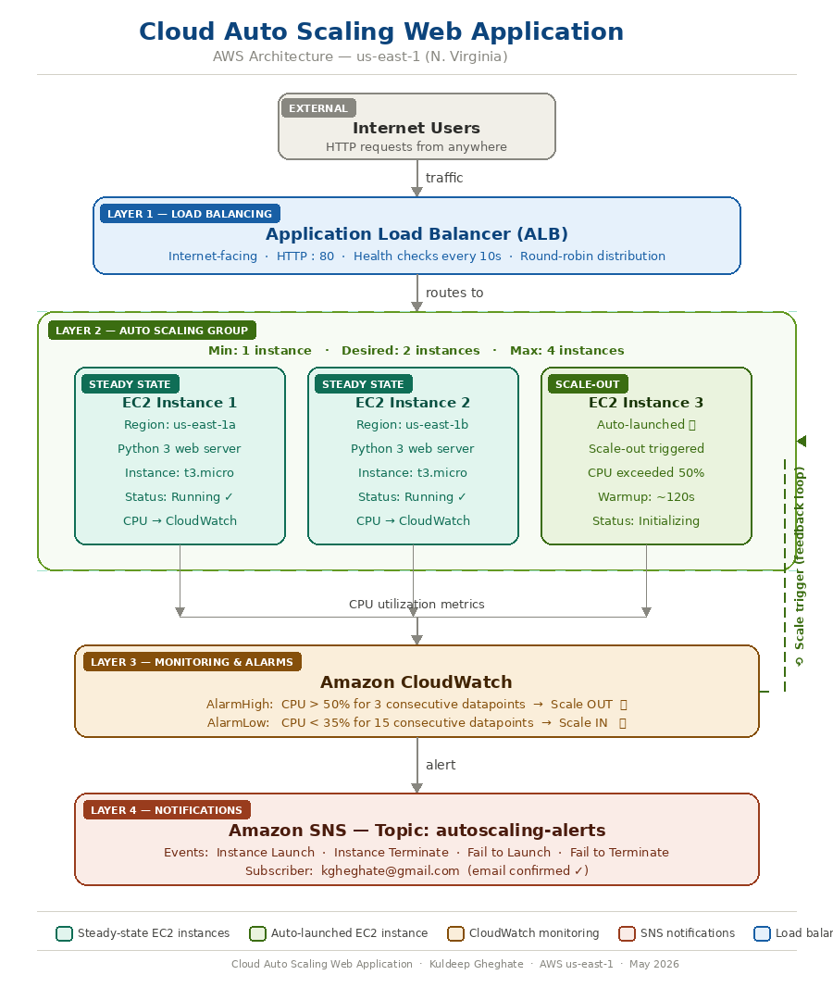

</div>

### How It Works — Step by Step

```
Internet Users
      │
      ▼  HTTP:80
Application Load Balancer (ALB)
      │  Round-robin · Health checks every 10s · Fault tolerant
      ▼
Auto Scaling Group  [Min:1 · Desired:2 · Max:4]
      ├── EC2 Instance 1  (us-east-1a)  →  Python web server
      ├── EC2 Instance 2  (us-east-1b)  →  Python web server
      └── EC2 Instance 3  (Auto-launched when CPU > 50%) ✨
      │
      ▼  CPU utilization metrics
Amazon CloudWatch
      │  AlarmHigh : CPU > 50% for 3 datapoints  →  Scale Out 🔺
      │  AlarmLow  : CPU < 35% for 15 datapoints →  Scale In  🔻
      ▼
Amazon SNS  →  Email alert sent to admin on every scaling event
```

---

## 🛠️ Tech Stack

| Layer | Technology | Purpose |
|---|---|---|
| ☁️ Cloud Platform | AWS (us-east-1) | Infrastructure host |
| 🖥️ Compute | Amazon EC2 (t3.micro) | Web server instances |
| ⚖️ Load Balancing | Application Load Balancer (ALB) | Traffic distribution |
| 📈 Auto Scaling | Auto Scaling Groups (ASG) | Dynamic instance scaling |
| 📊 Monitoring | Amazon CloudWatch | Metrics, alarms, dashboard |
| 🔔 Notifications | Amazon SNS | Email alerts on scaling events |
| 🌐 Networking | VPC, Subnets, Internet Gateway | Private network isolation |
| 🔐 Security | Security Groups, IAM | Two-layer access control |
| 🐍 Backend | Python 3 (HTTP Server) | Web application |
| 🔁 Version Control | GitHub | Source management |

---

## ✅ Features

- **Dynamic Auto Scaling** — target tracking policy maintains 50% average CPU utilization
- **Multi-AZ High Availability** — instances spread across us-east-1a and us-east-1b
- **Application Load Balancer** — round-robin distribution with health checks every 10 seconds
- **CloudWatch Dashboard** — real-time CPU graphs and instance count visualization
- **SNS Email Notifications** — instant alerts on every scale-out and scale-in event
- **Two-Layer Security** — EC2 only accepts traffic from ALB, never directly from internet
- **Zero-Downtime Scaling** — 120s warmup period before new instances receive live traffic
- **Live Load Tested** — verified with `stress --cpu 4` triggering real scale-out from 2 → 3 instances

---

## 📁 Project Structure

```
Cloud-Auto-Scaling-Web-Application/
│
├── app/
│   └── server.py                        # Python HTTP web server
│
├── infrastructure/
│   ├── vpc-setup.md                     # VPC, subnets, IGW configuration
│   ├── security-groups.md               # ALB and EC2 security group rules
│   ├── launch-template.md               # EC2 launch template + user data script
│   ├── alb-setup.md                     # Load balancer and target group config
│   └── asg-config.md                    # Auto scaling group + scaling policies
│
├── tests/
│   └── load-test.md                     # Stress test commands and results
│
├── docs/
│   ├── architecture-diagram.png         # AWS architecture diagram
│   └── screenshots/
│       ├── phase-1-networking/
│       ├── phase-2-security/
│       ├── phase-3-launch-template/
│       ├── phase-4-load-balancer/
│       ├── phase-5-auto-scaling/
│       └── phase-6-testing/
│
└── README.md
```

---

## 🚀 Implementation

### Phase 1 — Networking Setup

Built a custom VPC with 2 public subnets across 2 Availability Zones, with an Internet Gateway for public access.

| Resource | Configuration |
|---|---|
| VPC CIDR | 10.0.0.0/16 |
| Public Subnet 1 | 10.0.0.0/20 — us-east-1a |
| Public Subnet 2 | 10.0.16.0/20 — us-east-1b |
| Internet Gateway | Attached to VPC |
| Auto-assign Public IP | Enabled on both subnets |

<div align="center">

| VPC Creation — All Green ✅ | VPC Details — Available |
|:---:|:---:|
| 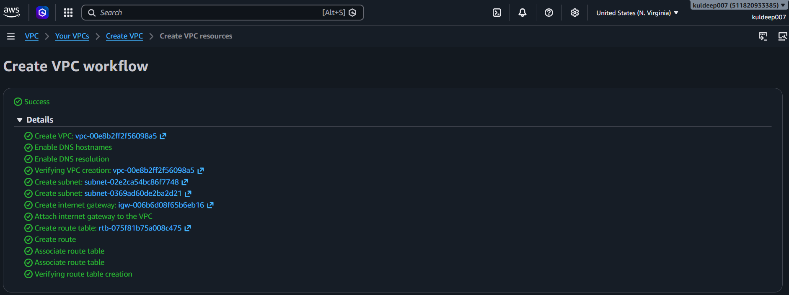 | 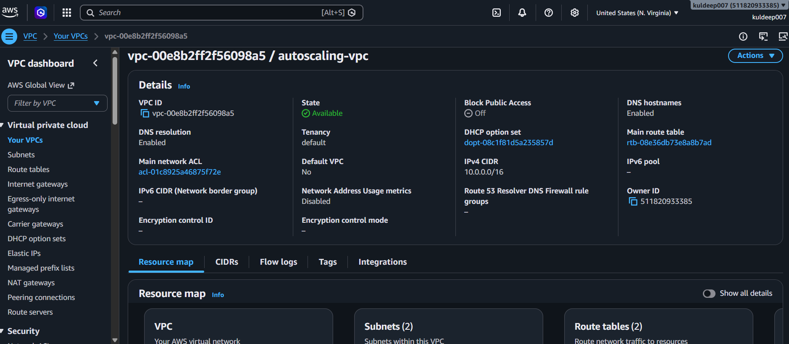 |

| Subnet Auto-IP Enabled | Internet Gateway Attached |
|:---:|:---:|
| 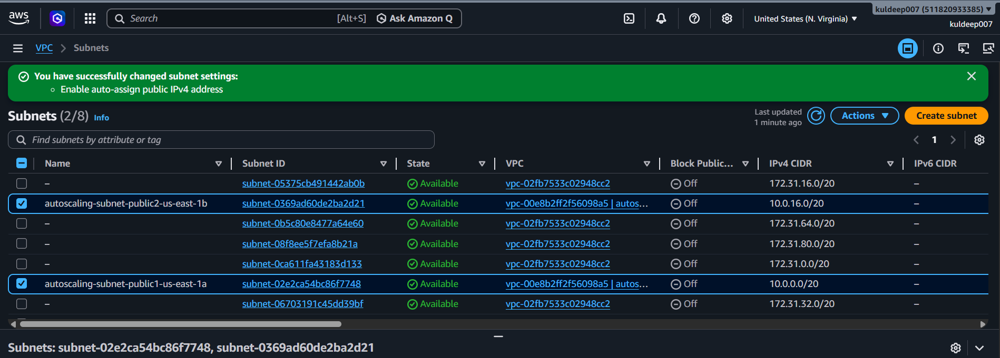 | 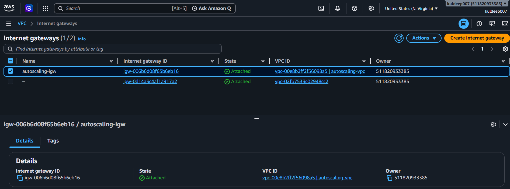 |

</div>

---

### Phase 2 — Security Groups

Implemented a two-layer security model. EC2 instances are **never directly reachable** from the internet — only the ALB can talk to them.

| Security Group | Inbound Rule | Source |
|---|---|---|
| `alb-security-group` | HTTP : 80 | 0.0.0.0/0 (Internet) |
| `alb-security-group` | HTTPS : 443 | 0.0.0.0/0 (Internet) |
| `ec2-security-group` | HTTP : 80 | `alb-security-group` only |
| `ec2-security-group` | SSH : 22 | 0.0.0.0/0 |

<div align="center">

| ALB Security Group | EC2 Security Group |
|:---:|:---:|
| 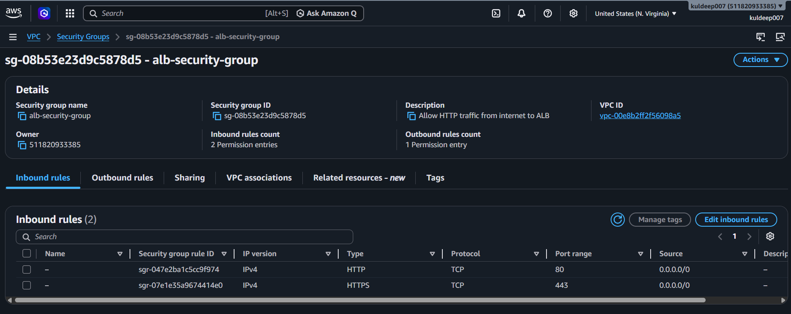 | 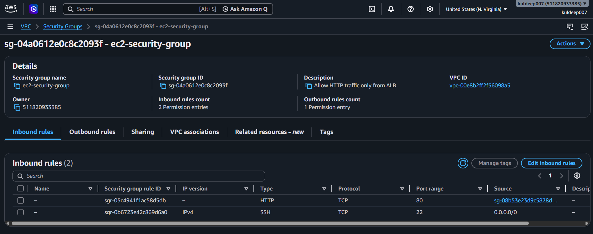 |

</div>

---

### Phase 3 — Launch Template

A reusable EC2 blueprint with a startup script that **automatically installs Python 3 and starts the web server** on every new instance — zero manual setup required.

**User Data Script (runs on every new instance automatically):**

```bash
#!/bin/bash
yum update -y
yum install python3 -y
python3 /home/ec2-user/server.py &
```

**Python Web Server (`app/server.py`):**

```python
from http.server import HTTPServer, BaseHTTPRequestHandler
import socket, datetime

class Handler(BaseHTTPRequestHandler):
    def do_GET(self):
        hostname = socket.gethostname()
        now = datetime.datetime.now().strftime("%Y-%m-%d %H:%M:%S")
        body = f"""<html><body style="font-family:sans-serif;padding:40px">
            <h1>Cloud Auto Scaling Web App</h1>
            <p><strong>Instance hostname:</strong> {hostname}</p>
            <p><strong>Time:</strong> {now}</p>
            <p style="color:green">This instance is healthy and serving traffic!</p>
        </body></html>"""
        self.send_response(200)
        self.send_header('Content-type', 'text/html')
        self.end_headers()
        self.wfile.write(body.encode())

HTTPServer(('0.0.0.0', 80), Handler).serve_forever()
```

<div align="center">

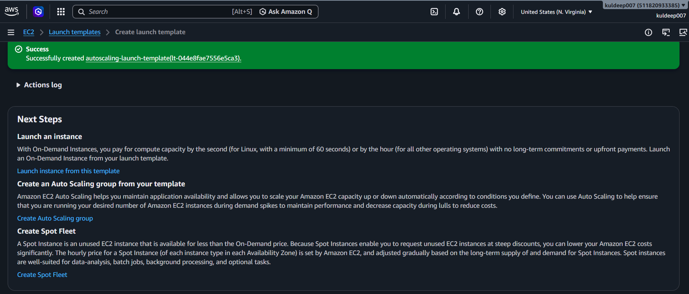

</div>

---

### Phase 4 — Application Load Balancer

Internet-facing ALB deployed across both Availability Zones. Routes traffic only to healthy EC2 instances based on continuous health checks.

| Setting | Value |
|---|---|
| Type | Application Load Balancer |
| Scheme | Internet-facing |
| Protocol | HTTP : 80 |
| Health check path | `/` |
| Health check interval | 10 seconds |
| Healthy threshold | 2 consecutive passes |
| Unhealthy threshold | 2 consecutive failures |

<div align="center">

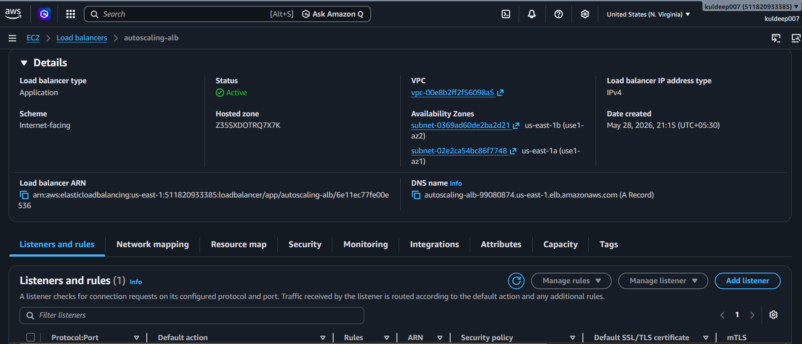

</div>

---

### Phase 5 — Auto Scaling Group

Target tracking scaling policy — AWS automatically provisions and terminates EC2 instances to maintain 50% average CPU utilization across the group.

| Setting | Value |
|---|---|
| Minimum instances | 1 |
| Desired instances | 2 |
| Maximum instances | 4 |
| Scaling metric | Average CPU Utilization |
| Target CPU | 50% |
| Scale-out trigger | CPU > 50% for 3 datapoints |
| Scale-in trigger | CPU < 35% for 15 datapoints |
| Instance warmup | 120 seconds |

<div align="center">

| ASG — Both Instances Healthy ✅ | EC2 Instances Running |
|:---:|:---:|
| 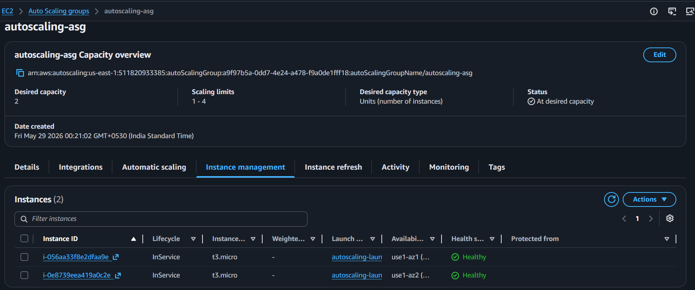 | 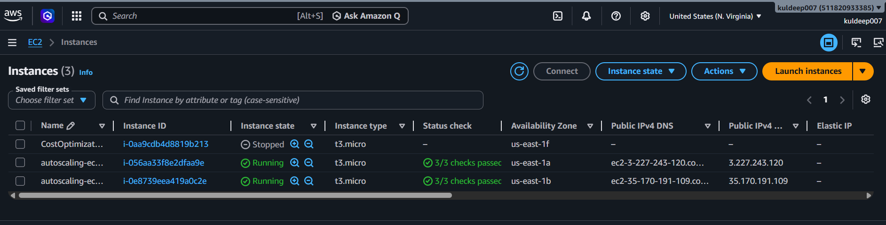 |

| Target Group — 2 Healthy Targets ✅ | |
|:---:|:---:|
| 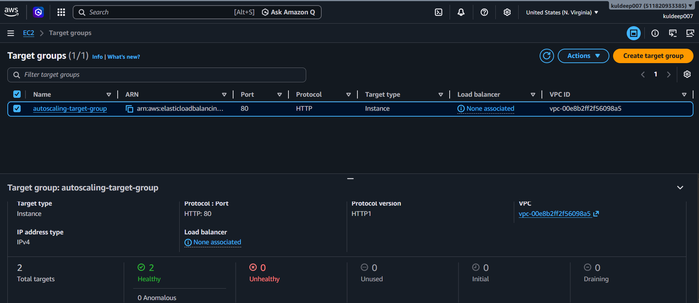 | |

</div>

---

### Phase 6 — Testing & Verification

#### ✅ Test 1 — Live App via Load Balancer

Opened the ALB DNS name in browser. Refreshing multiple times showed **different instance hostnames** — confirming the load balancer distributes traffic across both EC2 instances in round-robin.

<div align="center">

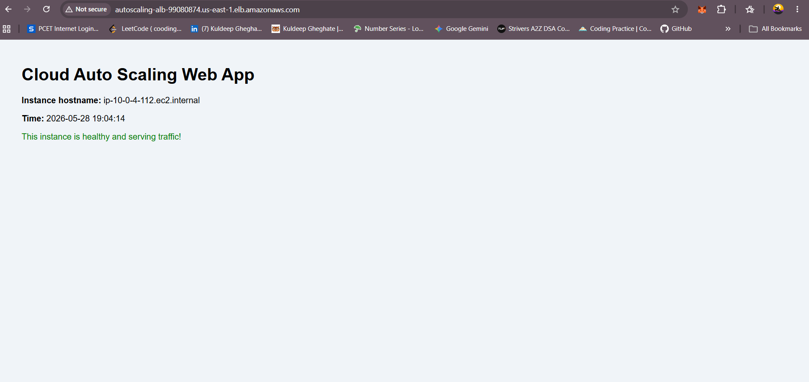

</div>

---

#### ✅ Test 2 — Auto Scaling Stress Test

Connected to EC2 via Instance Connect and ran a CPU stress test:

```bash
# Step 1 — Install stress tool
sudo yum install stress -y

# Step 2 — Max out CPU for 5 minutes
sudo stress --cpu 4 --timeout 300
```

**What happened:**
1. CPU spiked to ~100% on the instance
2. CloudWatch `AlarmHigh` fired (CPU > 50% for 3 datapoints)
3. ASG automatically launched a **3rd EC2 instance**
4. New instance passed health checks and started serving traffic
5. After 300s, stress ended → CPU dropped → ASG terminated the extra instance

<div align="center">

| Stress Test Running | 3rd Instance Auto-Launched ✨ |
|:---:|:---:|
| 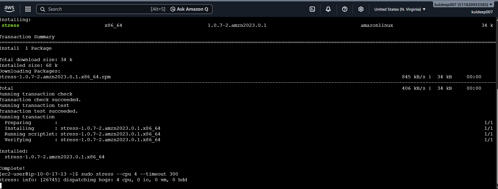 | 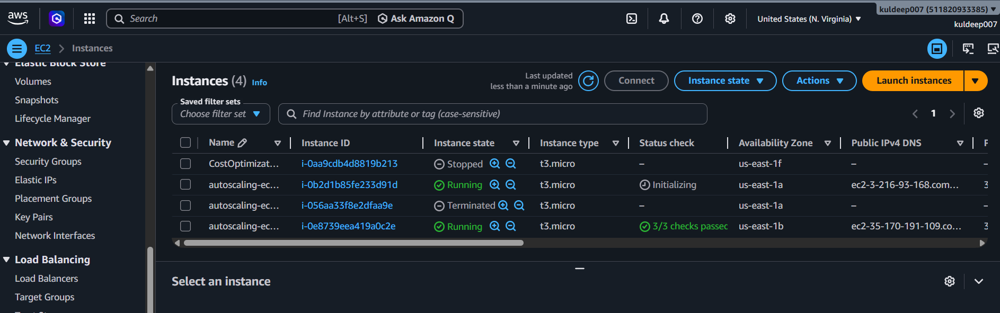 |

</div>

---

#### ✅ Test 3 — CloudWatch Dashboard Verified

Real-time dashboard confirmed the full scaling cycle — CPU spike, instance count 2 → 3, then back to 2 after load ended.

<div align="center">

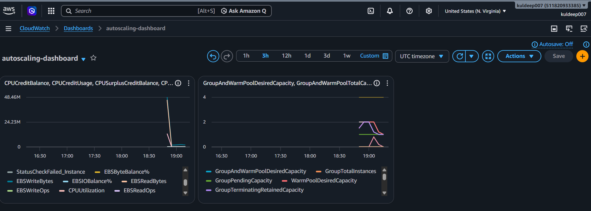

</div>

---

## 📸 Project Screenshots

<details>
<summary>📂 Click to expand — all 15 screenshots</summary>

<br>

### Phase 1 — Networking (4 screenshots)

| File | Description |
|---|---|
| `01-vpc-creation-success.png` | VPC + subnets + IGW all created with green checkmarks |
| `02-vpc-details-available.png` | VPC in Available state, CIDR 10.0.0.0/16 |
| `04-subnet-auto-ip-enabled.png` | Auto-assign public IPv4 enabled on subnets |
| `05-internet-gateway-attached.png` | Internet Gateway attached to autoscaling-vpc |

### Phase 2 — Security (2 screenshots)

| File | Description |
|---|---|
| `06-alb-security-group.png` | ALB security group — HTTP+HTTPS from internet |
| `07-ec2-security-group.png` | EC2 security group — HTTP from ALB only |

### Phase 3 — Launch Template (1 screenshot)

| File | Description |
|---|---|
| `09-launch-template-created.png` | Launch template creation success |

### Phase 4 — Load Balancer (1 screenshot)

| File | Description |
|---|---|
| `12-alb-active-with-dns.png` | ALB Active with DNS name visible |

### Phase 5 — Auto Scaling (3 screenshots)

| File | Description |
|---|---|
| `15-asg-two-instances-healthy.png` | Both instances InService and Healthy |
| `16-ec2-instances-running.png` | 2 EC2s running across us-east-1a and 1b |
| `17-target-group-two-healthy.png` | Target group showing 2 healthy targets |

### Phase 6 — Testing (4 screenshots)

| File | Description |
|---|---|
| `18-app-live-in-browser.png` | Web app live via ALB DNS in browser |
| `20-cloudwatch-dashboard-scaling.png` | Dashboard — CPU spike + instance count graph |
| `21-stress-test-running.png` | Terminal — stress dispatching 4 CPU hogs |
| `22-asg-scaled-out-new-instance.png` | 3rd instance Initializing — scale-out confirmed! |

</details>

---

## 💡 Key Learnings

- **Auto scaling is fully event-driven** — CloudWatch metric → Alarm → Scaling Policy → ASG action, zero manual intervention
- **Health checks protect users** — ALB automatically stops routing to unhealthy instances
- **Security groups chain together** — EC2 is isolated from direct internet access, only ALB can reach it
- **Warmup periods are essential** — new instances need startup time before handling real traffic
- **Multi-AZ means real high availability** — if us-east-1a fails, us-east-1b keeps serving users

---

## 💰 Cost Summary

| Service | Usage | Free Tier |
|---|---|---|
| EC2 t3.micro | 2 instances | 750 hrs/month ✅ |
| Application Load Balancer | ~3 hrs for project | ~$0.05 |
| CloudWatch | Metrics + alarms | 10 alarms free ✅ |
| SNS | Email notifications | 1M publishes free ✅ |
| VPC / Subnets / IGW | Full project | Always free ✅ |

**Total project cost: < $0.05**

---

## 🔗 Related Projects

- 🔧 [AWS Cloud Resource Cost Optimization](https://github.com/KuldeepShivajiraoGheghate/aws-cloud-cost-optimization) — Event-driven Lambda to auto-stop idle EC2 instances, reducing compute waste by ~40%
- 🖼️ [Serverless Image Processing Pipeline](https://github.com/KuldeepShivajiraoGheghate/Serverless-Image-Processing-Pipeline-AWS-) — S3-triggered Lambda pipeline with sub-second invocation latency

---

## 👤 Author

<div align="center">

**Kuldeep Gheghate**
*Computer Engineering Undergraduate — PCCOE*
*Specializing in AWS Cloud Infrastructure & Serverless Architecture*

<br>

[](mailto:kgheghate@gmail.com)
[](https://www.linkedin.com/in/kuldeep-gheghate)
[](https://github.com/KuldeepShivajiraoGheghate)

</div>

---

## ⭐ Support

If this project helped you understand AWS auto scaling:

- Give it a **star ⭐** on GitHub
- Share it with others learning cloud engineering

---

<div align="center">

*Built with ☁️ on AWS &nbsp;|&nbsp; May 2026 &nbsp;|&nbsp; us-east-1 (N. Virginia)*

</div>
